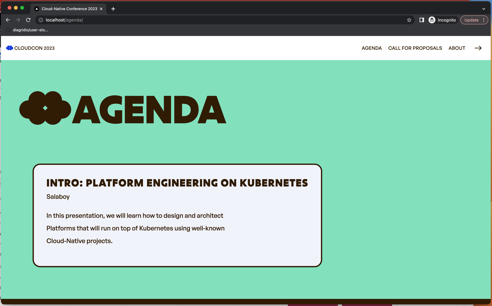

# Chapter 1 :: (The rise of) Platforms on Top of Kubernetes

## Conference Application Scenario

The application that we will be modifying and using throughtout all the book chapters represent a simple "walking skeleton" meaning that it is complex enough to allows us to test asumptions, tools and frameworks, but it is not the final product that our customers will use. 

The "Conference Application" walking skeleton implements a very simple use case, allowing potential speakers to submit proposals that will be evaluated by the conference organizers. 

The flow is simple. Potential speakers can submit a new proposal by going to the **Call for Proposals** section of the application.

Once submitted, the conference organizers can review (approve or reject) submitted proposals in the **Backoffice** section of the application.

If the proposal is accepted it is automatically published into the conference **Agenda** page.

In the **Backoffice** you can check the **Notifications** tab that shows all the notifications (emails) sent to the potential speakers. You will see both approval and rejection emails in this tab. 

Every action in the application emit events, hence, when a new proposal is submitted, when the proposal is accepted or rejected and when notifications are sent events are sent and captured by the application frontend. You can check these events into the **Events** tab in the **Backoffice** section.

## Pre-requisites for the other chapters

The following tools are required for the step-by-step tutorials linked in the book. 

- [Docker](https://docs.docker.com/engine/install/)
  - Note: You can try to use [Podman](https://podman.io/) as well, as there is nothing specific to Docker, but all the tutorials had been tested with Docker.
- [kubectl](https://kubernetes.io/docs/tasks/tools/)
- [KinD](https://kind.sigs.k8s.io/docs/user/quick-start/)
- [Helm](https://helm.sh/docs/intro/install/) 

## Sum up and Contribute

Do you want to improve this tutorial? Create an issue, drop me a message on [Twitter](https://twitter.com/salaboy) or send a Pull Request.

